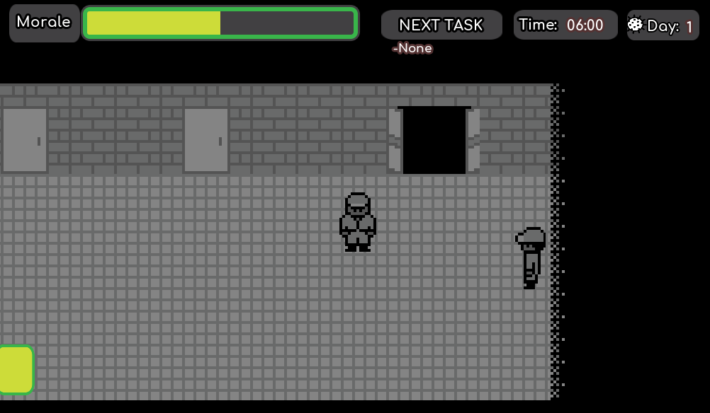
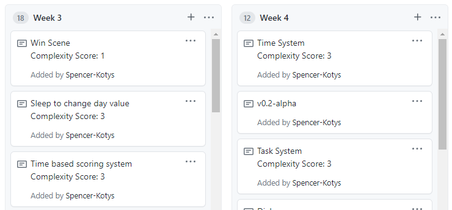
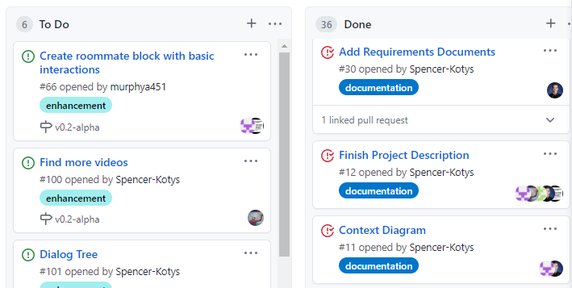
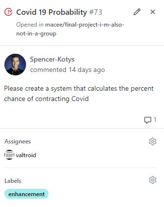
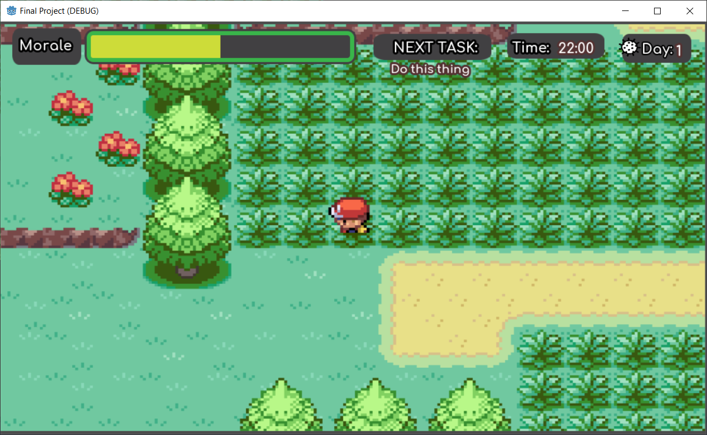

# Implementation Update

## Project Overview

ROM is a two-dimensional simulation game, and it uses a top-down design in which
the camera follows the player.

The player will have a morale meter that goes up when the player engages with
NPCs, varying based on which character the player interacts with. When a player
stays alone for too long or does not complete tasks, their morale meter depletes.
Additionally, If a player gets a class offense when they interact with their
Company Officer, their morale meter will also receive a significant hit.

If the morale meter reaches zero, the game ends in a loss. The player can also
lose by getting sent to Munro Hall, which would occur if the player gets COVID-19
or gets contact traced by one of the characters the player interacts with.

When the player attends social events and interacts with other characters to
improve their morale, there is an increased random chance that they can be sent
down to Munro Hall or test positive for COVID-19.

The player's goal is to balance maintaining the morale meter with limiting the
chances of getting COVID-19. While maintaining the morale meter and staying
healthy, the player must complete tasks such as filling out health forms,
attending meals and formation, working out, interacting with the company
officer, and sleeping. The player must complete at least three tasks each day
before going to sleep in order to advance to the next day. Each day, the player
is subjected to a random chance of contracting COVID-19 in addition to their
regular interactions. When a player gets COVID-19, they are taken to the lose
screen and offered the opportunity to play again. If the player makes it to the
end of day 14 by completing sufficient tasks, maintaining their morale meter,
and staying healthy, then they win!

## Project Board

Creating and maintaining this board has been a combination of adding cards for
each week based on what we want to complete each sprint and creating issues
linked to the board for each specific team member to complete before the end of
the sprint.

## Issues faced by the team and how they were overcome

Getting GitHub to interface well with our game engine, Godot, has been one of
our biggest reoccurring issues.

After changing to a different branch, GitHub Desktop will bring changes from the
previous branch to the current branch despite no changes being made to the
current branch. A work-around to this has just been immediately discarding
changes upon a branch switch.

Another problem came up when we tried to restore stashed changes, and it broke
the entire game. This was because GitHub was treating our Godot scenes as if
they were text files, and was inserting text to identify where the changes were.
In order to fix it, we had to manually go through all the altered Godot files
and delete GitHub’s added text. The solution going forward has been to either
commit or discard changes before changing to a different branch so they are not
stashed.

Finally, early on in development, a group member pushed a change to our main
branch that broke most of the systems. This was fixed through selective
reversions and re-commits, and then the permanent solution was to have only
Spencer coordinate merging all the individual member branches into main.

A recently fixed problem turned out to be caused by the Godot engine itself.
When loading into a new scene (i.e. walking from the main hallway into the
  player’s room or vice versa), the player’s morale bar would spike up in value,
  seemingly at random. It turned out this was a common bug in Godot; upon
  entering a new scene the physics engine automatically detects collision with
  all the objects in that scene. This was an issue because player morale was set
  to go up upon colliding with certain characters in the main hallway. This is
  why the morale meter would spike upon loading the scene. The only fix to this
  was a workaround with a 1 second timer. The timer starts when the scene loads
  in, and while it’s, running collision detection is turned off. This creates a
  one second buffer when loading into a new scene and it prevents all the
  collisions from being immediately detected and increasing the player’s morale.
  We also had to use a timer to fix a similar collision issue with the dialogue
  system. Giving the game a single second to run through a couple more process
  loops before impacting the player has improved overall game stability.

Communication and the assignment of specific tasks was a big issue at the
beginning of the development cycle. When all we had was a blank game file, it
was hard to assign specific tasks to certain people. This led to development
being a bit rushed in the beginning by one or two people. However, once we had
a baseline to work with and improve upon, it became much easier to coordinate
with the group, assign deadlines, and have a better idea of where the project
was going. It also became easier to assign non-coding based tasks to group
members who didn’t feel as comfortable working in Godot.

## Retrospective on work done

In retrospect, we would all agree that we could have planned a bit better from
the start. The biggest hurdle we had to overcome was getting everyone familiar
with using the Godot engine. We eventually all got familiar with Godot, but it
would have been easier if we had worked through a brief tutorial together to
ensure we all had a base level of understanding. Much of what was done in the
first week would probably take less than half as long to do now with our current
experience levels. However, we did utilize online resources very well when we
were trying to create the first alpha version of the game. Using temporary
assets found in YouTube tutorials and online guides was a life-saver because it
allowed us to continue to program the necessary systems, without having to wait
for the game’s final artwork to be finished.

Godot was also a good choice for our game engine; we would not change it if we
had the chance to go back. It was overwhelming at first, but the amount of
resources and tutorials online made it quick to learn. Godot is also a very
lightweight program, meaning it runs well on the school laptops, does not take
up a lot of space, and loads quickly when we need to work.

The image above is from testing the first mock-up of the game’s HUD. The HUD
itself hasn’t changed much, but we no longer have to use screenshots of Pokémon
games to get a sense for the scaling.

## Upcoming sprints

The core game mechanics have been implemented. Going forward, we need to polish
the game and add in more story aspects. We need to finish the remaining artwork
and make the start of the game flow better. Integrating the name that the player
enters is imperative for this week. Since all of the basic game logic is built,
these steps should not be technically challenging.

A large component of the upcoming sprint will also be testing the game to ensure
it is balanced and running smoothly. This is an area that could be more
challenging, as the cause of errors will have to be identified and addressed.
